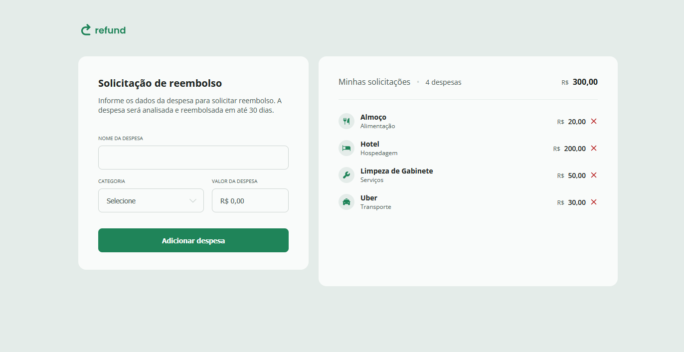

# Refund

A web application for managing expense refund requests, built with vanilla HTML, CSS, and JavaScript as part of web development studies.

## 📋 Project Overview

This application allows users to submit expense refund requests by filling out a form with expense details. Users can add multiple expenses, view them in a list, and remove them as needed. The application automatically calculates and displays the total amount of all expenses.

## 🚀 Features

- **Add Expenses**: Submit expense details including name, category, and amount
- **Real-time Currency Formatting**: Automatic BRL (Brazilian Real) currency formatting as you type
- **Expense Categories**: Choose from predefined categories (Food, Accommodation, Services, Transport, Others)
- **Dynamic List Management**: View all added expenses in a responsive list
- **Remove Expenses**: Delete individual expenses with a single click
- **Total Calculation**: Automatic calculation and display of total expenses
- **Responsive Design**: Works seamlessly on desktop and mobile devices

## 🛠️ Technologies Used

- **HTML5**: Semantic markup and form structure
- **CSS3**: Styling, flexbox layout, and responsive design
- **Vanilla JavaScript**: DOM manipulation, event handling, and data processing

## 💻 Key JavaScript Features

### Form Handling

- Real-time currency input formatting
- Form validation and submission prevention
- Dynamic expense object creation

### DOM Manipulation

- Dynamic list item creation
- Element selection and modification
- Event delegation for expense removal

### Data Processing

- Currency formatting with [`formatCurrencyBRL`](scripts.js) function
- Total calculation with proper number parsing
- Input sanitization and validation

## 🔧 How to Use

1. **Clone or download** the project files
2. **Open** [`index.html`](index.html) in your web browser
3. **Fill out the form** with expense details:
   - Enter expense name
   - Select a category from the dropdown
   - Enter the amount (automatically formatted as currency)
4. **Click "Adicionar despesa"** to add the expense to the list
5. **View your expenses** in the right panel
6. **Remove expenses** by clicking the remove icon next to any item

## 🌟 Future Enhancements

Potential improvements for continued learning:

- Local storage persistence
- Expense editing functionality
- Date range filtering
- Export to PDF/CSV
- Dark mode toggle
- Form validation improvements

## 📄 License

This project is for educational and demonstration purposes.

---

Made with ❤️ by <a href="https://www.linkedin.com/in/gustavo-santos-744549234/">Gustavo Arruda</a>

